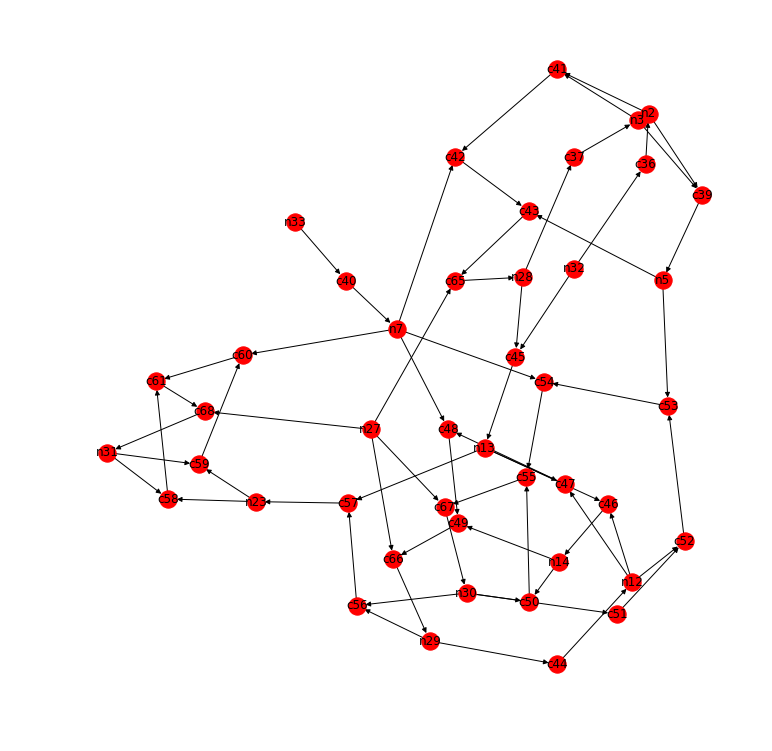
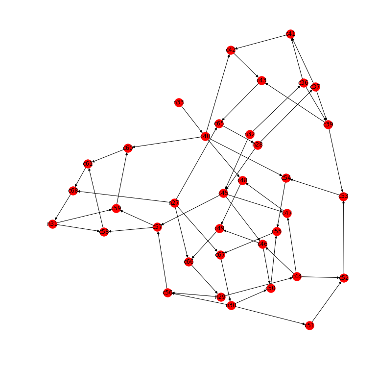
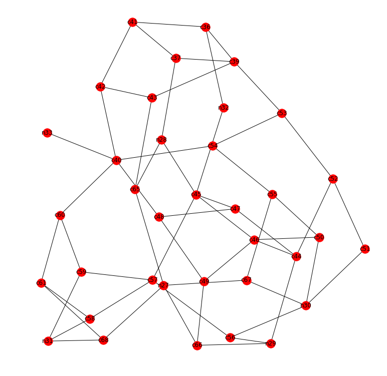

```python
import os
import networkx as nx
import pydotplus
import matplotlib.pyplot as plt
import itertools
```


```python
command = """
read_verilog counter.v
proc; opt; fsm; opt; memory; opt
techmap; opt
dfflibmap -liberty cmos_cells.lib
abc -liberty cmos_cells.lib
splitnets -ports; opt
read_liberty -lib cmos_cells.lib
show -format png -prefix counter
show -format dot -prefix counter
"""
os.system('yosys -p "%s"' % command)
```


    0


```python
os.system('sed -i "s/:[^ ]*//g" counter.dot')
```


    0


```python
with open('counter.dot') as f:
    s = f.read()
g = pydotplus.parser.parse_dot_data(s)
G = nx.nx_pydot.from_pydot(g)
```


```python
plt.figure(figsize=(10,10))
nx.draw_kamada_kawai(G, with_labels=True)
```





```python
# nodes with diamond or point shapes are internal nets
remove = [x for x in G.nodes if G.node[x]['shape'] in ('diamond','point')]
remove
```


    ['n23', 'n2', 'n12', 'n5', 'n3', 'n14', 'n7', 'n13']


```python
for node in remove:
    # reroute around each target node
    new_edges = itertools.product(G.predecessors(node), G.successors(node))
    G.add_edges_from(new_edges)
# delete target nodes
G.remove_nodes_from(remove)
```


```python
plt.figure(figsize=(10,10))
nx.draw_kamada_kawai(G, with_labels=True)
```





```python
# simple cycles in the directed graph show cyclical paths
c1 = list(nx.simple_cycles(G))
(c1, len(c1))
```


    ([['c39', 'c43', 'c65', 'n28', 'c37'],
      ['c43', 'c65', 'n28', 'c37', 'c41', 'c42'],
      ['c49', 'c66', 'n29', 'c44', 'c46'],
      ['c49', 'c66', 'n29', 'c44', 'c47', 'c48'],
      ['c52', 'c53', 'c54', 'c55', 'c67', 'n30', 'c51'],
      ['n30', 'c50', 'c55', 'c67'],
      ['c59', 'c60', 'c61', 'c68', 'n31'],
      ['c58', 'c61', 'c68', 'n31']],
     8)


```python
G2 = nx.Graph(G.to_undirected())
```


```python
plt.figure(figsize=(10,10))
nx.draw_kamada_kawai(G2, with_labels=True)
```

    /usr/local/lib/python3.5/dist-packages/networkx/drawing/nx_pylab.py:611: MatplotlibDeprecationWarning: isinstance(..., numbers.Number)
      if cb.is_numlike(alpha):





```python
# cycle basis in undirected graph shows both cyclical and reconvergent paths
c2 = nx.cycle_basis(G2)
(c2, len(c2))
```


    ([['n28', 'c45', 'n32', 'c36', 'c39', 'c43', 'c65'],
      ['c46', 'c45', 'n32', 'c36', 'c39', 'c43', 'c65', 'n27', 'c66', 'c49'],
      ['c48',
       'c47',
       'c45',
       'n32',
       'c36',
       'c39',
       'c43',
       'c65',
       'n27',
       'c66',
       'c49'],
      ['c46', 'c44', 'c47', 'c45'],
      ['n29',
       'c44',
       'c47',
       'c45',
       'n32',
       'c36',
       'c39',
       'c43',
       'c65',
       'n27',
       'c66'],
      ['c53', 'c52', 'c44', 'c47', 'c45', 'n32', 'c36', 'c39'],
      ['c67',
       'n30',
       'c51',
       'c52',
       'c44',
       'c47',
       'c45',
       'n32',
       'c36',
       'c39',
       'c43',
       'c65',
       'n27'],
      ['n29', 'c56', 'n30', 'c51', 'c52', 'c44'],
      ['c57', 'c56', 'n30', 'c51', 'c52', 'c44', 'c47', 'c45'],
      ['c46', 'c50', 'n30', 'c51', 'c52', 'c44'],
      ['c67', 'c55', 'c50', 'n30'],
      ['c53', 'c54', 'c55', 'c50', 'n30', 'c51', 'c52'],
      ['c48', 'c40', 'c54', 'c55', 'c50', 'n30', 'c51', 'c52', 'c44', 'c47'],
      ['c42',
       'c40',
       'c54',
       'c55',
       'c50',
       'n30',
       'c51',
       'c52',
       'c44',
       'c47',
       'c45',
       'n32',
       'c36',
       'c39',
       'c43'],
      ['c68',
       'c61',
       'c60',
       'c40',
       'c54',
       'c55',
       'c50',
       'n30',
       'c51',
       'c52',
       'c44',
       'c47',
       'c45',
       'n32',
       'c36',
       'c39',
       'c43',
       'c65',
       'n27'],
      ['c57',
       'c58',
       'c61',
       'c60',
       'c40',
       'c54',
       'c55',
       'c50',
       'n30',
       'c51',
       'c52',
       'c44',
       'c47',
       'c45'],
      ['c59', 'n31', 'c58', 'c61', 'c60'],
      ['c68', 'n31', 'c58', 'c61'],
      ['c57',
       'c59',
       'c60',
       'c40',
       'c54',
       'c55',
       'c50',
       'n30',
       'c51',
       'c52',
       'c44',
       'c47',
       'c45'],
      ['c37', 'c41', 'c36', 'c39'],
      ['c42', 'c41', 'c36', 'c39', 'c43'],
      ['n28', 'c37', 'c39', 'c43', 'c65']],
     22)


```python
G2.number_of_nodes(), G2.number_of_edges()
```


    (36, 57)


```python
# edge list for exporting to SAT solver
list(G2.edges())
```


    [('c49', 'c48'),
     ('c49', 'c46'),
     ('c49', 'c66'),
     ('c46', 'c50'),
     ('c46', 'c45'),
     ('c46', 'c44'),
     ('n33', 'c40'),
     ('c39', 'c53'),
     ('c39', 'c43'),
     ('c39', 'c37'),
     ('c39', 'c36'),
     ('c40', 'c60'),
     ('c40', 'c48'),
     ('c40', 'c54'),
     ('c40', 'c42'),
     ('c55', 'c50'),
     ('c55', 'c54'),
     ('c55', 'c67'),
     ('c56', 'n30'),
     ('c56', 'n29'),
     ('c56', 'c57'),
     ('c36', 'c41'),
     ('c36', 'n32'),
     ('n30', 'c50'),
     ('n30', 'c51'),
     ('n30', 'c67'),
     ('c66', 'n29'),
     ('c66', 'n27'),
     ('c58', 'n31'),
     ('c58', 'c57'),
     ('c58', 'c61'),
     ('c45', 'n28'),
     ('c45', 'c57'),
     ('c45', 'c47'),
     ('c45', 'n32'),
     ('c53', 'c52'),
     ('c53', 'c54'),
     ('n31', 'c59'),
     ('n31', 'c68'),
     ('n29', 'c44'),
     ('c41', 'c37'),
     ('c41', 'c42'),
     ('c65', 'n28'),
     ('c65', 'n27'),
     ('c65', 'c43'),
     ('c59', 'c60'),
     ('c59', 'c57'),
     ('c52', 'c51'),
     ('c52', 'c44'),
     ('c43', 'c42'),
     ('c60', 'c61'),
     ('n28', 'c37'),
     ('c47', 'c44'),
     ('c47', 'c48'),
     ('c68', 'n27'),
     ('c68', 'c61'),
     ('c67', 'n27')]


